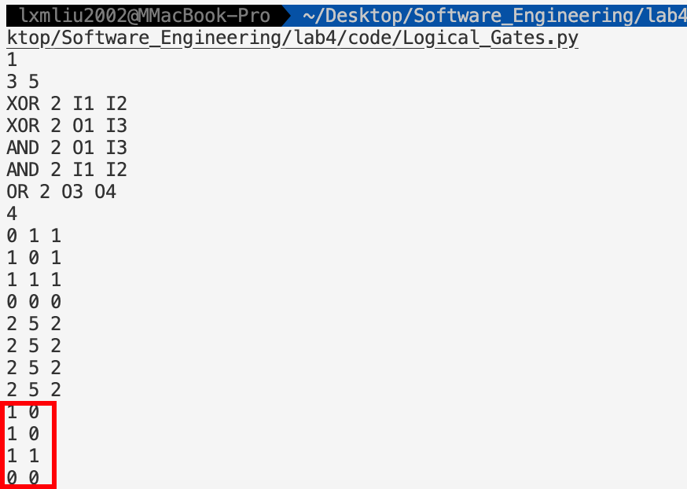
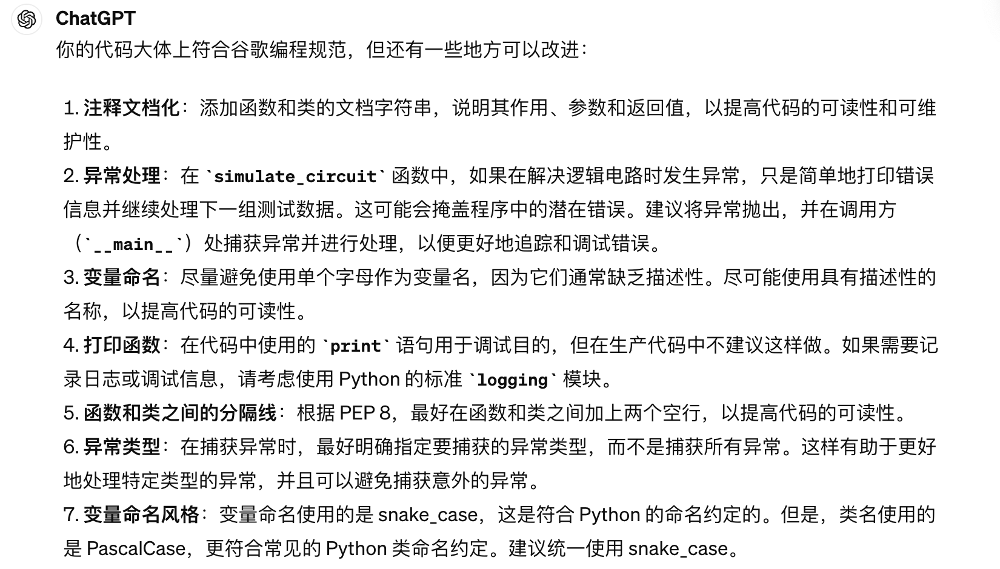
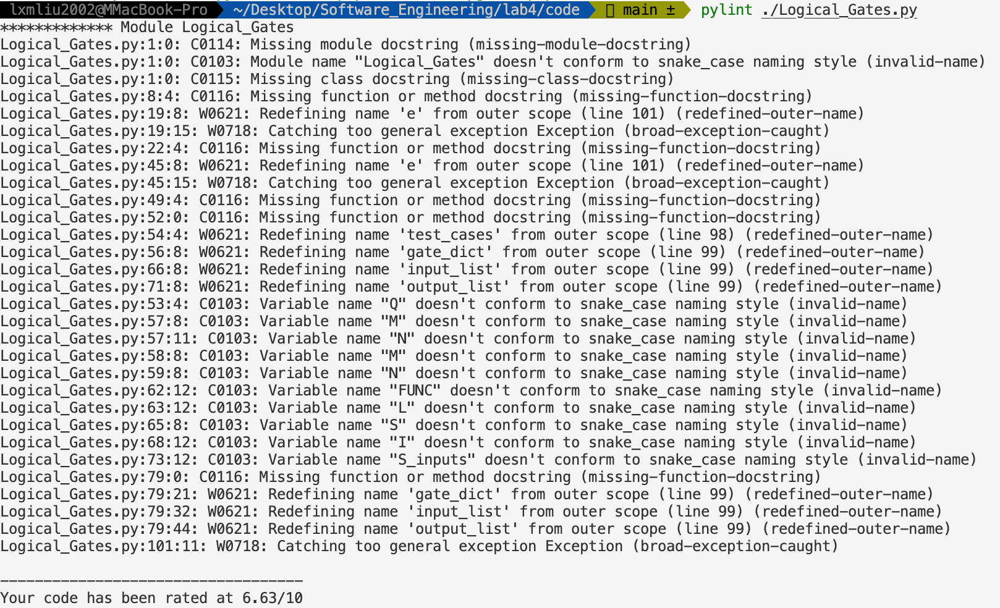
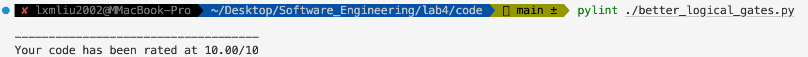
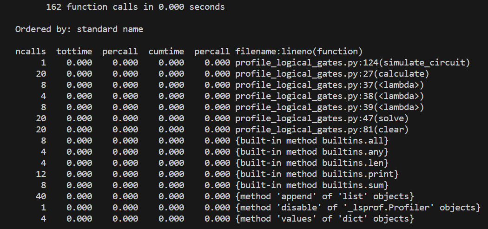
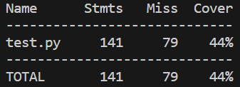
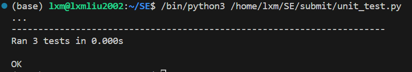
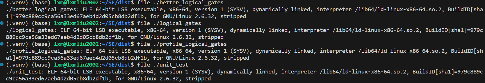

# <center>**软件工程实验报告**</center>

<center>Lab4 编程实现、分析和测试</center>

<center> 网络空间安全学院 信息安全专业</center>

<center> 2112492 刘修铭 1027</center>

## 编程实现

> 为了对后面的编程规范等留出优化空间，此处展示最初未进行优化的代码，但是保证结果的正确性。

本次实验使用 python 进行实现。

首先创建了一个电路门类，为其进行一定的初始化。

```python
class Gate:
    def __init__(self, func_str: str, input_lst: list):
        self.func = func_str
        self.input = input_lst
        self.val = None
        self.loop = False
```

接着按照题目要求，创建了一个 calculate 函数，用于完成门电路的计算。由于题目限定了门电路的种类，基于此插入了错误处理。

```python
def calculate(self, input_lst):
    try:
        operations = {
            "NOT": lambda x: int(not x[0]),
            "AND": lambda x: int(all(x)),
            "OR": lambda x: int(any(x)),
            "XOR": lambda x: int(sum(x) % 2),
            "NAND": lambda x: int(not all(x)),
            "NOR": lambda x: int(not any(x))
        }
        self.val = operations[self.func](input_lst)
    except Exception as e:
        print(f"Error occurred while calculating {self.func}: {e}")
```

在本次中，逻辑电路可以看作是一个有向图，其中门（或逻辑门）表示图中的节点，门之间的连接表示有向边，输入端口表示图的起始节点，输出端口表示图的终止节点。在有向图中，如果存在循环，则一定存在一条路径从某个节点出发，经过若干条边回到该节点，这种路径称为循环路径。在逻辑电路中，循环依赖即表示存在循环路径。

通过在逻辑电路中进行深度优先搜索（DFS），可以在图中遍历节点，并在遍历过程中标记已经访问过的节点。如果在遍历过程中发现某个节点已经被标记为已访问过，则说明存在循环依赖，因为在有向图中，节点的访问顺序是由边的方向所决定的，如果已经访问过某个节点，则再次访问该节点必定会回到之前已访问过的节点，形成循环。

solve 函数对门进行深度优先搜索，并使用 loop 属性来标记已经访问过的节点。在遍历过程中，如果发现某个节点已经被访问过，则将该节点的 loop 属性设置为 `True`，表示存在循环依赖，直接返回 0，停止继续计算该节点的值。这样可以确保在计算逻辑电路的值时，不会陷入循环依赖导致的无限递归或死循环，保证了算法的正确性和鲁棒性。

```python
def solve(self, gates, inputs, visited):
    try:
        if self.loop:
            return 0
        tmp_lst = []
        if self.val is None:
            for name in self.input:
                if name in visited:
                    self.loop = True
                    return 0
                if name[0] == "I":
                    tmp_lst.append(inputs[int(name[1:])])
                elif name in gates:
                    if gates[name].val is None:
                        visited.add(name)
                        gates[name].solve(gates, inputs, visited)
                        visited.remove(name)
                    if gates[name].val is None:
                        self.loop = True
                        return 0
                    tmp_lst.append(gates[name].val)
            self.calculate(tmp_lst)
        return self.val
    except Exception as e:
        print(f"Error occurred while solving: {e}")
        return None
```

然后编写了一个函数用于按照规定格式读入数据，并且设计数据结构进行存储。注意到，题目中提到**<u>“注意 O 序列不一定是递增的，即要求输出的器件可能以任意顺序出现。”</u>**此处对于读入的数据进行处理时，按照题目中的设定，将其输入格式均保存。此处采用 dict 数据类型保存门电路的输入等，采用键值对的形式进行处理，避免了下标越界等问题。

```python
def get_data():
    Q = int(input())
    test_cases = []
    for _ in range(Q):
        gate_dict = {}
        M, N = input().split()
        M = int(M)
        N = int(N)
        for i in range(N):
            inputs = input().split()
            FUNC = inputs[0]
            L = inputs[2:]
            gate_dict[f"O{i + 1}"] = Gate(FUNC, L)
        S = int(input())
        input_list = []
        for _ in range(S):
            I = input().split()
            inputs = {index + 1: int(val) for index, val in enumerate(I)}
            input_list.append(inputs)
        output_list = []
        for _ in range(S):
            S_inputs = input().split()
            output_lst = [int(val) for val in S_inputs[1:]]
            output_list.append(output_lst)
        test_cases.append((gate_dict, input_list, output_list))
    return test_cases
```

simulate_circuit 函数基于前面的输入调用函数进行直接计算。

1. 使用 `zip` 函数将 `input_list` 和 `output_list` 中的元素一一对应起来，形成一个迭代器，在每次迭代中得到一组输入值 `inputs` 和对应的期望输出值 `expected_output`。
2. 在每组输入值 `inputs` 上模拟逻辑电路的行为，通过 `gate_dict` 中的门逐一计算其输出值，并与期望输出值进行比较。
3. 在模拟逻辑电路的过程中，如果发现存在环，则输出 "LOOP" 并跳过当前组输入的模拟，进行下一组输入的模拟。
4. 如果不存在环，则将计算得到的输出值依次输出。

```python
def simulate_circuit(gate_dict, input_list, output_list):
    for inputs, expected_output in zip(input_list, output_list):
        is_loop = False
        for gate in gate_dict.values():
            gate.clear()
        for j in range(1, len(gate_dict) + 1):
            gate_dict[f"O{j}"].solve(gate_dict, inputs, set())
            if gate_dict[f"O{j}"].loop:
                is_loop = True
                break
        if is_loop:
            print("LOOP")
            continue
        for output_index in expected_output:
            print(gate_dict[f"O{output_index}"].val, end=' ')
        print("")
```

main 主函数中，则调用前面的函数进行综合计算。

运行给定测试样例，可以看到，输出的结果与预期输出相同，说明编程正确。




## 编程规范

> 参考的哪个规范，如何检查是否遵守编程规范的？

本次编程主要参考 [Google 开源项目风格指南](https://zh-google-styleguide.readthedocs.io/en/latest/google-python-styleguide/contents.html)。

在进行编程规范检查时，使用 ChatGPT 进行检查，得到如下的输出结果。



针对其给出的改进说明，参考 [Google 开源项目风格指南](https://zh-google-styleguide.readthedocs.io/en/latest/google-python-styleguide/contents.html)，将代码作如下修改。

```python
class Gate:
    """
    Represents a logic gate.

    Attributes:
        func (str): The logic function of the gate.
        inputs (list): The list of input ports.
        val (int): The output value of the gate.
        loop (bool): Flag indicating if there is a loop during solving.
    """

    def __init__(self, func_str: str, input_lst: list):
        """
        Initializes a Gate instance.

        Args:
            func_str (str): The logic function string.
            input_lst (list): The list of input ports.
        """
        self.func = func_str
        self.inputs = input_lst
        self.val = None
        self.loop = False

    def calculate(self, input_lst):
        """
        Calculates the output value of the gate.

        Args:
            input_lst (list): The list of input values.
        """
        try:
            operations = {
                "NOT": lambda x: int(not x[0]),
                "AND": lambda x: int(all(x)),
                "OR": lambda x: int(any(x)),
                "XOR": lambda x: int(sum(x) % 2),
                "NAND": lambda x: int(not all(x)),
                "NOR": lambda x: int(not any(x))
            }
            self.val = operations[self.func](input_lst)
        except Exception as e:
            raise RuntimeError(f"Error occurred while calculating {self.func}: {e}")

    def solve(self, gates, inputs, visited):
        """
        Solves the gate.

        Args:
            gates (dict): Dictionary containing gate instances.
            inputs (dict): Dictionary containing input values.
            visited (set): Set containing visited gate names.
        """
        try:
            if self.loop:
                return 0
            tmp_lst = []
            if self.val is None:
                for name in self.inputs:
                    if name in visited:
                        self.loop = True
                        return 0
                    if name[0] == "I":
                        tmp_lst.append(inputs[int(name[1:])])
                    elif name in gates:
                        if gates[name].val is None:
                            visited.add(name)
                            gates[name].solve(gates, inputs, visited)
                            visited.remove(name)
                        if gates[name].val is None:
                            self.loop = True
                            return 0
                        tmp_lst.append(gates[name].val)
                self.calculate(tmp_lst)
            return self.val
        except Exception as e:
            raise RuntimeError(f"Error occurred while solving: {e}")

    def clear(self):
        """Clears the output value of the gate."""
        self.val = None

def get_data():
    """
    Retrieves test case data from input.

    Returns:
        list: List of test cases.
    """
    try:
        Q = int(input())
        test_cases = []
        for _ in range(Q):
            gate_dict = {}
            M, N = input().split()
            M = int(M)
            N = int(N)
            for i in range(N):
                inputs = input().split()
                FUNC = inputs[0]
                L = inputs[2:]
                gate_dict[f"O{i + 1}"] = Gate(FUNC, L)
            S = int(input())
            input_list = []
            for _ in range(S):
                I = input().split()
                inputs = {index + 1: int(val) for index, val in enumerate(I)}
                input_list.append(inputs)
            output_list = []
            for _ in range(S):
                S_inputs = input().split()
                output_lst = [int(val) for val in S_inputs[1:]]
                output_list.append(output_lst)
            test_cases.append((gate_dict, input_list, output_list))
        return test_cases
    except Exception as e:
        raise RuntimeError(f"Error occurred while getting data: {e}")

def simulate_circuit(gate_dict, input_list, output_list):
    """
    Simulates the logic circuit.

    Args:
        gate_dict (dict): Dictionary containing gate instances.
        input_list (list): List of input values.
        output_list (list): List of expected output values.
    """
    try:
        for inputs, expected_output in zip(input_list, output_list):
            is_loop = False
            for gate in gate_dict.values():
                gate.clear()
            for j in range(1, len(gate_dict) + 1):
                gate_dict[f"O{j}"].solve(gate_dict, inputs, set())
                if gate_dict[f"O{j}"].loop:
                    is_loop = True
                    break
            if is_loop:
                print("LOOP")
                continue
            for output_index in expected_output:
                print(gate_dict[f"O{output_index}"].val, end=' ')
            print("")
    except Exception as e:
        raise RuntimeError(f"Error occurred while simulating circuit: {e}")

if __name__ == "__main__":
    try:
        test_cases = get_data()
        for gate_dict, input_list, output_list in test_cases:
            simulate_circuit(gate_dict, input_list, output_list)
    except Exception as e:
        print(f"Error occurred: {e}")
```

使用 [pylint](https://pypi.org/project/pylint/) 进行原始代码的静态分析，得到如下的结果。



针对于这些问题，将其进行一定的修改，得到如下修改后的代码。

```python
"""
Module: better_logical_gates.py
Description: Contains classes and functions for simulating logical gates
"""

class Gate:
    """
    Represents a logic gate.

    Attributes:
        func (str): The logic function of the gate.
        inputs (list): The list of input ports.
        val (int): The output value of the gate.
        loop (bool): Flag indicating if there is a loop during solving.
    """

    def __init__(self, func_str: str, input_lst: list):
        """
        Initializes a Gate instance.

        Args:
            func_str (str): The logic function string.
            input_lst (list): The list of input ports.
        """
        self.func = func_str
        self.inputs = input_lst
        self.val = None
        self.loop = False

    def calculate(self, input_lst):
        """
        Calculates the output value of the gate.

        Args:
            input_lst (list): The list of input values.
        """
        operations = {
            "NOT": lambda x: int(not x[0]),
            "AND": lambda x: int(all(x)),
            "OR": lambda x: int(any(x)),
            "XOR": lambda x: int(sum(x) % 2),
            "NAND": lambda x: int(not all(x)),
            "NOR": lambda x: int(not any(x))
        }
        assert self.func in operations, f"Invalid logic function: {self.func}"
        self.val = operations[self.func](input_lst)

    def solve(self, gates, inputs, visited):
        """
        Solves the gate.

        Args:
            gates (dict): Dictionary containing gate instances.
            inputs (dict): Dictionary containing input values.
            visited (set): Set containing visited gate names.
        """
        if self.loop:
            return 0
        tmp_lst = []
        if self.val is None:
            for name in self.inputs:
                assert name[0] == "I" or name in gates, f"Invalid input: {name}"
                if name[0] == "I":
                    assert int(name[1:]) in inputs, f"Input not provided: {name}"
                    tmp_lst.append(inputs[int(name[1:])])
                else:
                    if gates[name].val is None:
                        assert name not in visited, f"Loop detected: {name}"
                        visited.add(name)
                        gates[name].solve(gates, inputs, visited)
                        visited.remove(name)
                        assert gates[name].val is not None, f"Gate not solved: {name}"
                    tmp_lst.append(gates[name].val)
            self.calculate(tmp_lst)
        return self.val

    def clear(self):
        """Clears the output value of the gate."""
        self.val = None


def get_data():
    """
    Retrieves test case data from input.

    Returns:
        list: List of test cases.
    """
    q = int(input())
    test_cases = []
    for _ in range(q):
        gate_dict = {}
        _, n = map(int, input().split())
        for i in range(n):
            inputs = input().split()
            func = inputs[0]
            l = inputs[2:]
            gate_dict[f"O{i + 1}"] = Gate(func, l)
        s = int(input())
        input_list = []
        for _ in range(s):
            i = input().split()
            inputs = {index + 1: int(val) for index, val in enumerate(i)}
            input_list.append(inputs)
        output_list = []
        for _ in range(s):
            s_inputs = input().split()
            output_lst = [int(val) for val in s_inputs[1:]]
            output_list.append(output_lst)
        test_cases.append((gate_dict, input_list, output_list))
    return test_cases


def simulate_circuit(gate_dict, input_list, output_list):
    """
    Simulates the logic circuit.

    Args:
        gate_dict (dict): Dictionary containing gate instances.
        input_list (list): List of input values.
        output_list (list): List of expected output values.
    """
    for inputs, expected_output in zip(input_list, output_list):
        is_loop = False
        for gate in gate_dict.values():
            gate.clear()
        for j in range(1, len(gate_dict) + 1):
            gate_dict[f"O{j}"].solve(gate_dict, inputs, set())
            if gate_dict[f"O{j}"].loop:
                is_loop = True
                break
        if is_loop:
            print("LOOP")
            continue
        for output_index in expected_output:
            print(gate_dict[f"O{output_index}"].val, end=' ')
        print("")


if __name__ == "__main__":
    cases = get_data()
    for gate_dict, input_list, output_list in cases:
        simulate_circuit(gate_dict, input_list, output_list)

```

对其进行检查，可以看到，所有的问题都已经解决。




## 可扩展性

> 如何提高代码的可扩展性？

对于此编程任务，主要的扩展方向为门电路种类的增加。

本次实验主要有两种拓展思路。

首先，在原始代码中，门电路的实现部分主要在 **calculate** 函数中。即按照门电路要求添加对应的 FUNC 与其计算过程。因此，如果需要扩展，按照要扩展的门电路的要求，对其进行功能与名称的添加即可。

第二种思路则是对现有的代码进行修改，将逻辑门的 calculate 函数和 solve 函数作为接口，并为每种逻辑门创建一个独立的子类。这样做可以轻松地添加新的逻辑门类型，并且使得代码更易于理解和维护。在此给出一个代码示例，不做具体实现。

```python
from abc import ABC, abstractmethod

class LogicGate(ABC):
    """
    Abstract base class for logic gates.
    """
    @abstractmethod
    def calculate(self, input_lst):
        """
        Calculates the output value of the gate.

        Args:
            input_lst (list): The list of input values.
        """
        pass

    @abstractmethod
    def solve(self, gates, inputs, visited):
        """
        Solves the gate.

        Args:
            gates (dict): Dictionary containing gate instances.
            inputs (dict): Dictionary containing input values.
            visited (set): Set containing visited gate names.
        """
        pass

    @abstractmethod
    def clear(self):
        """
        Clears the output value of the gate.
        """
        pass

class NOTGate(LogicGate):
    """
    Represents a NOT logic gate.
    """
    def __init__(self, input_port):
        self.input = input_port
        self.val = None
        self.loop = False

    def calculate(self, input_lst):
        assert len(input_lst) == 1, "NOT gate expects exactly 1 input"
        self.val = int(not input_lst[0])

    def solve(self, gates, inputs, visited):
        if self.loop:
            return 0
        if self.val is None:
            assert self.input in inputs, f"Input not provided: {self.input}"
            self.calculate([inputs[self.input]])
        return self.val

    def clear(self):
        self.val = None

# 添加其他逻辑门的类似实现...

def create_gate(func_str, input_lst):
    """
    Factory function to create logic gates based on function string.

    Args:
        func_str (str): The logic function string.
        input_lst (list): The list of input ports.

    Returns:
        LogicGate: An instance of the appropriate logic gate class.
    """
    if func_str == "NOT":
        assert len(input_lst) == 1, "NOT gate expects exactly 1 input"
        return NOTGate(input_lst[0])
    # 添加其他逻辑门类型的判断和实例化...

```


## 错误与异常处理

在代码中，主要使用 try-except 进行处理。

1. **Gate 类的方法（`calculate`、`solve`、`clear`）**：每个方法都包裹在 `try-except` 块中。如果在计算、求解或清除过程中发生异常（比如使用未定义的门电路，如 add），会引发一个 `RuntimeError`，并提供适当的错误消息。
2. **`get_data` 函数**：此函数从输入中获取测试用例数据。将主要逻辑包装在 `try-except` 块中。如果在检索过程中发生异常，会引发一个 `RuntimeError`，并提供错误的详细信息。
3. **`simulate_circuit` 函数**：此函数模拟逻辑电路。使用了 `try-except` 块，以捕获模拟过程中的任何异常，并引发 `RuntimeError`，提供相关的错误消息。

除此之外，在输入信息时，使用 `assert` 对输入进行检查，要求输入必须是 I 或 O 开头。

```python
assert all(val.startswith('O') or val.startswith('O') for val in L[2:]), "Invalid gate inputs"
```


## 算法复杂度

1. 初始化门电路时，对于每个逻辑门，初始化一个 Gate 实例，时间复杂度为 O(N)，其中 N 是逻辑门的数量。
2. 在 `solve` 方法中，算法通过深度优先搜索（DFS）的方式解决了逻辑门之间的依赖关系。每个逻辑门最多访问一次，而访问每个逻辑门需要的时间取决于其输入端口的数量。因此，解决整个电路的时间复杂度为 O(N*M)，其中 N 是逻辑门的数量，M 是平均每个门的输入端口数量。
3. 如果不存在环，就要计算每个端口的输出。对于每个输出端口，算法需要遍历一次逻辑门，查找其输出值，时间复杂度为 O(N)。

综上，整个算法的时间复杂度为 O(N*(M+1))，其中 N 是逻辑门的数量，M 是平均每个门的输入端口数量。空间复杂度主要取决于存储 Gate 实例和输入数据的空间，为 O(N)。


## 性能分析与代码优化

### 性能分析

此次编程的性能主要受如下几个因素影响：

1. **逻辑门数量 (N)**：逻辑门数量直接影响着算法的性能。随着逻辑门数量的增加，算法需要解决的依赖关系也会增加，从而增加算法的执行时间。
2. **逻辑门的输入端口数量 (M)**：每个逻辑门的输入端口数量也会影响算法的性能。如果每个逻辑门都有大量的输入端口，算法在解决依赖关系和计算输出值时会花费更多的时间。
3. **输入数据的规模**：输入数据的规模（例如测试用例的数量、每个测试用例的输入值数量）也会影响算法的性能。更大规模的输入数据需要更多的计算资源来处理。
4. **硬件设备性能**：算法的性能还受到执行环境的硬件设备性能的影响。更高性能的处理器和内存可以提高算法的执行效率。

在此，使用 `cProfile` 进行性能测试。其中

* `ncalls`：表示函数被调用的次数。
* `tottime`：表示函数在自身内部消耗的总时间（不包括调用其他函数的时间）。
* `percall`：表示每次函数调用的平均时间（`tottime / ncalls`）。
* `cumtime`：表示函数在包括调用其他函数的情况下消耗的总时间（即总运行时间）。
* `percall`：表示每次函数调用的平均时间（`cumtime / ncalls`）。



对于图中的结果，可以得到如下结论：

* `simulate_circuit` 函数总共被调用了 1 次，消耗了 0.000 秒。这是因为我们在 `main` 函数中直接调用了它，且程序运行时间很短。
* `calculate` 函数总共被调用了 20 次，消耗了 0.000 秒。这个函数用于计算逻辑门的输出值，由于逻辑简单，消耗的时间非常小。
* `solve` 函数总共被调用了 20 次，消耗了 0.000 秒。这个函数用于解决逻辑门之间的依赖关系，同样由于逻辑简单，消耗的时间很小。
* `clear` 函数总共被调用了 20 次，消耗了 0.000 秒。这个函数用于清除逻辑门的输出值，同样消耗的时间很小。
* 其他的函数调用和内置函数调用消耗的时间也都非常小。
* 此处使用的测试样例数据量较小，故而所有的数值几乎都为 0。

### 代码优化

在编写代码时，主要对门电路的实现进行了优化。最开始实现的时候，每个门电路定义了一个函数，在 calculate 函数中进行计算时，调用函数即可。为了避免多次的函数调用，简化代码逻辑，将各个计算函数优化到 calculate 函数中。

还有一些其他优化比如数据结构的选择，已经在前面提过，在此不再赘述。

在此，给出几个优化思路。

1. 优化循环结构，减少时间复杂度和内存占用
2. 细化错误处理，更好地检测代码 bug
3. 添加编码注释，使得他人能够更好地理解代码逻辑


## 单元测试

> 测试用例设计思路、测试覆盖指标、覆盖率、测试通过率

测试用例设计中，核心问题是需要考虑输入的情况是否将编程的情况全部“遍历”到，也就是类似于符号执行中，要执行到所有的路径。通用的思路为：

1. **边界情况测试**：测试输入值为边界情况时的行为，例如空输入、最小输入、最大输入等。
2. **功能测试**：测试代码的各种功能是否按预期工作。针对 `Gate` 类的各个方法，测试不同逻辑函数、不同输入情况下的计算结果是否正确。
3. **异常情况测试**：测试代码在异常情况下的行为是否符合预期。例如，当输入参数非法时，是否会抛出预期的异常。
4. **性能测试**：测试代码在大规模输入情况下的性能表现。虽然代码已经经过优化，但仍然需要确保在大规模输入情况下能够快速运行。
5. **集成测试**：在整个程序中，模拟整个逻辑电路的行为并测试其正确性。

基于此，给出如下的设计思路：

1. 对于 `Gate` 类的 `calculate` 方法：
   * 测试各种逻辑函数的计算结果是否正确。
   * 测试输入参数为边界情况时的计算结果是否正确。
2. 对于 `Gate` 类的 `solve` 方法：
   * 测试当门输入端口存在循环依赖时，是否能够正确检测到循环。
   * 测试当门输入端口存在非法输入时，是否能够正确处理异常情况。
3. 对于 `get_data` 函数：
   * 测试当输入数据格式不正确时，是否能够正确抛出异常。
   * 测试当输入数据为空时，是否能够正确处理。
4. 对于 `simulate_circuit` 函数：
   * 测试当逻辑电路存在循环时，是否能够正确检测到循环。
   * 测试当输入数据为空时，是否能够正确处理。

有如下的设计测试覆盖指标、覆盖率和测试通过率的实现方案。

1. **测试覆盖指标设计**：
   * **代码行覆盖率**：使用测试覆盖工具运行测试，并生成代码行覆盖率报告。
   * **分支覆盖率**：同样使用测试覆盖工具，但需要确保测试用例能够覆盖所有可能的分支。
   * **函数覆盖率**：同样使用测试覆盖工具，确保每个函数都至少被一个测试用例调用。
2. **覆盖率计算**：
   * 对于代码行覆盖率和分支覆盖率，通过测试覆盖工具生成的报告直接获取。
   * 对于函数覆盖率，我们可以通过记录每个函数的调用情况来计算。
3. **测试通过率计算**：
   * 在运行测试时，记录成功通过的测试用例数量。
   * 在测试结束后，计算测试通过率。

在此，基于上述方案，给出如下实现代码：

```python
import coverage
class Gate:
    """
    Represents a logic gate.

    Attributes:
        func (str): The logic function of the gate.
        inputs (list): The list of input ports.
        val (int): The output value of the gate.
        loop (bool): Flag indicating if there is a loop during solving.
    """

    def __init__(self, func_str: str, input_lst: list):
        """
        Initializes a Gate instance.

        Args:
            func_str (str): The logic function string.
            input_lst (list): The list of input ports.
        """
        self.func = func_str
        self.inputs = input_lst
        self.val = None
        self.loop = False

    def calculate(self, input_lst):
        """
        Calculates the output value of the gate.

        Args:
            input_lst (list): The list of input values.
        """
        try:
            operations = {
                "NOT": lambda x: int(not x[0]),
                "AND": lambda x: int(all(x)),
                "OR": lambda x: int(any(x)),
                "XOR": lambda x: int(sum(x) % 2),
                "NAND": lambda x: int(not all(x)),
                "NOR": lambda x: int(not any(x))
            }
            self.val = operations[self.func](input_lst)
        except Exception as e:
            raise RuntimeError(f"Error occurred while calculating {self.func}: {e}")

    def solve(self, gates, inputs, visited):
        """
        Solves the gate.

        Args:
            gates (dict): Dictionary containing gate instances.
            inputs (dict): Dictionary containing input values.
            visited (set): Set containing visited gate names.
        """
        try:
            if self.loop:
                return 0
            tmp_lst = []
            if self.val is None:
                for name in self.inputs:
                    if name in visited:
                        self.loop = True
                        return 0
                    if name[0] == "I":
                        tmp_lst.append(inputs[int(name[1:])])
                    elif name in gates:
                        if gates[name].val is None:
                            visited.add(name)
                            gates[name].solve(gates, inputs, visited)
                            visited.remove(name)
                        if gates[name].val is None:
                            self.loop = True
                            return 0
                        tmp_lst.append(gates[name].val)
                self.calculate(tmp_lst)
            return self.val
        except Exception as e:
            raise RuntimeError(f"Error occurred while solving: {e}")

    def clear(self):
        """Clears the output value of the gate."""
        self.val = None


def get_data():
    """
    Retrieves test case data from input.

    Returns:
        list: List of test cases.
    """
    try:
        Q = int(input())
        test_cases = []
        for _ in range(Q):
            gate_dict = {}
            M, N = input().split()
            M = int(M)
            N = int(N)
            for i in range(N):
                inputs = input().split()
                FUNC = inputs[0]
                L = inputs[2:]
                # assert all(val.startswith('O') or val.startswith('O') for val in L[2:]), "Invalid gate inputs"
                gate_dict[f"O{i + 1}"] = Gate(FUNC, L)
            S = int(input())
            input_list = []
            for _ in range(S):
                I = input().split()
                inputs = {index + 1: int(val) for index, val in enumerate(I)}
                input_list.append(inputs)
            output_list = []
            for _ in range(S):
                S_inputs = input().split()
                output_lst = [int(val) for val in S_inputs[1:]]
                output_list.append(output_lst)
            test_cases.append((gate_dict, input_list, output_list))
        return test_cases
    except Exception as e:
        raise RuntimeError(f"Error occurred while getting data: {e}")


def simulate_circuit(gate_dict, input_list, output_list):
    """
    Simulates the logic circuit.

    Args:
        gate_dict (dict): Dictionary containing gate instances.
        input_list (list): List of input values.
        output_list (list): List of expected output values.
    """
    try:
        for inputs, expected_output in zip(input_list, output_list):
            is_loop = False
            for gate in gate_dict.values():
                gate.clear()
            for j in range(1, len(gate_dict) + 1):
                gate_dict[f"O{j}"].solve(gate_dict, inputs, set())
                if gate_dict[f"O{j}"].loop:
                    is_loop = True
                    break
            if is_loop:
                print("LOOP")
                break
            for output_index in expected_output:
                print(gate_dict[f"O{output_index}"].val, end=' ')
            print("")
    except Exception as e:
        raise RuntimeError(f"Error occurred while simulating circuit: {e}")

def run_tests():
    # 运行测试，并生成覆盖率报告
    cov = coverage.Coverage()
    cov.start()
    # 运行测试代码
    try:
        test_cases = get_data()
        for gate_dict, input_list, output_list in test_cases:
            simulate_circuit(gate_dict, input_list, output_list)
    except Exception as e:
        print(f"Error occurred: {e}")
    finally:
        cov.stop()
        cov.save()

def calculate_coverage():
    # 计算覆盖率
    cov = coverage.Coverage()
    cov.load()
    cov.report()

def calculate_pass_rate():
    # 计算测试通过率
    total_tests = get_total_tests()  # 获取总测试用例数量
    passed_tests = get_passed_tests()  # 获取通过的测试用例数量
    pass_rate = passed_tests / total_tests
    return pass_rate

def get_total_tests():
    # 获取总测试用例数量
    total_tests = 0
    try:
        test_cases = get_data()
        for _, input_list, _ in test_cases:
            total_tests += len(input_list)
    except Exception as e:
        print(f"Error occurred while getting total tests: {e}")
    return total_tests

def get_passed_tests():
    # 获取通过的测试用例数量
    passed_tests = 0
    try:
        test_cases = get_data()
        for gate_dict, input_list, output_list in test_cases:
            passed_tests += count_passed_tests(gate_dict, input_list, output_list)
    except Exception as e:
        print(f"Error occurred while getting passed tests: {e}")
    return passed_tests

def count_passed_tests(gate_dict, input_list, output_list):
    # 计算通过的测试用例数量
    passed_tests = 0
    try:
        for inputs, expected_output in zip(input_list, output_list):
            actual_output = simulate_circuit(gate_dict, inputs)
            if actual_output == expected_output:
                passed_tests += 1
    except Exception as e:
        print(f"Error occurred while counting passed tests: {e}")
    return passed_tests

if __name__ == "__main__":
    run_tests()
    calculate_coverage()
    pass_rate = calculate_pass_rate()
    print(f"Test pass rate: {pass_rate}")
```

基于给定的样例进行测试，可以看到其覆盖率为 44%。



使用 `unittest` 工具对其进行测试，测试每个门电路以及各个函数的功能。

```python
import unittest

class TestGate(unittest.TestCase):
    def test_calculate(self):
        # Test each logic operation
        gate = Gate("NOT", [0])
        gate.calculate([0])
        self.assertEqual(gate.val, 1)

        gate = Gate("AND", [1, 0, 1])
        gate.calculate([1, 0, 1])
        self.assertEqual(gate.val, 0)

        gate = Gate("OR", [1, 0, 1])
        gate.calculate([1, 0, 1])
        self.assertEqual(gate.val, 1)

        gate = Gate("XOR", [1, 0, 1])
        gate.calculate([1, 0, 1])
        self.assertEqual(gate.val, 0)

        gate = Gate("NAND", [1, 0, 1])
        gate.calculate([1, 0, 1])
        self.assertEqual(gate.val, 1)

        gate = Gate("NOR", [1, 0, 1])
        gate.calculate([1, 0, 1])
        self.assertEqual(gate.val, 0)

        # Test error handling
        gate = Gate("NOT", [0])
        with self.assertRaises(RuntimeError):
            gate.calculate([])  # Empty input list

    def test_solve(self):
        # Test solving logic gates
        gate_dict = {
            "O1": Gate("AND", ["I1", "I2"]),
            "O2": Gate("OR", ["I1", "I3"])
        }
        inputs = {1: 1, 2: 0, 3: 1}
        visited = set()
        gate_dict["O1"].solve(gate_dict, inputs, visited)
        gate_dict["O2"].solve(gate_dict, inputs, visited)
        self.assertEqual(gate_dict["O1"].val, 0)
        self.assertEqual(gate_dict["O2"].val, 1)

        # Test handling loops
        gate_dict = {
            "O1": Gate("AND", ["O2"]),
            "O2": Gate("OR", ["O1"])
        }
        inputs = {}
        visited = set()
        gate_dict["O1"].solve(gate_dict, inputs, visited)
        self.assertTrue(gate_dict["O1"].loop)
        self.assertEqual(gate_dict["O1"].val, None)

    def test_clear(self):
        # Test clearing gate value
        gate = Gate("AND", ["I1", "I2"])
        gate.val = 1
        gate.clear()
        self.assertEqual(gate.val, None)

if __name__ == "__main__":
    unittest.main()

```

运行代码，得到如下结果，说明单元测试通过率为 100%。




## 实验收获

经过本次实验，对于个人编程习惯有了一个较好的改观，掌握了一些之前从未接触到的编程规范性问题。同时，也了解到许多编程中能够用到的小技巧，比如性能分析、单元测试的工具等。

总的来说，收获颇丰。


## 文件说明

本次实验中用到的所有代码均在 `code` 文件夹中。

* better_logical_gates.py 是经过规范性处理后的代码

* logical_gates.py 是原始的编程代码

* profile_logical_gates.py 是用于使用 cProfile 进行性能分析的代码

* unit_test.py 则是使用 unittest 进行单元测试的代码

* dist 文件夹中存放本次实验生成的可执行文件。如图可以看到其文件格式

  

  * better_logical_gates、logical_gates 和 profile_logical_gates 需要参照给定输入要求，输入规定格式的数据
  * unit_test 直接运行即可得到输出结果


```shell
.
├── code
│   ├── better_logical_gates.py
│   ├── logical_gates.py
│   ├── profile_logical_gates.py
│   ├── unit_test.py
│   └── dist
│       ├── better_logical_gates
│       ├── logical_gates
│       ├── profile_logical_gates
│       └── unit_test
└── report.pdf
```
